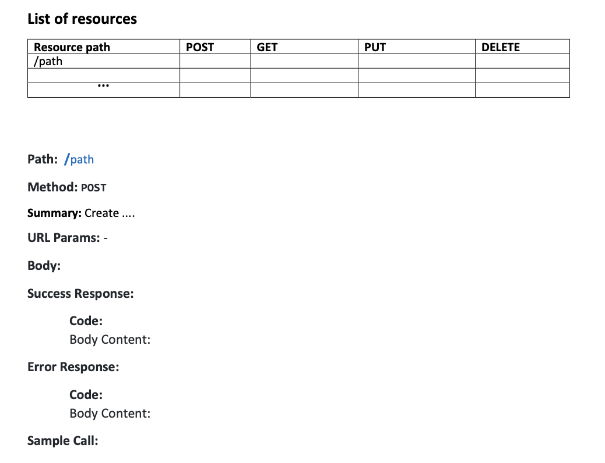

# Project 2: Development of Webshop RESTful API

The developed RESTful API should enable clients to get information about the\
webshop offer and support operations on the user’s shopping basket.

### Functional requirements:

The RESTful API should support the following operations:

- Get most important information about all products that are offered.
- Get product categories that exist.
- Get all details about a specific product.
- Get most important information about products for a specific category.
- Create a shopping basket for a specific user.
- Put a product in the basket for a specific user.
- Remove a product from the basket for a specific user.
- Get the shopping basket content for a specific user.

### Non-Functional requirements:

- API should be developed in JavaScript using Node.js and Express framework.
- API should use JSON as data format in HTTP messages.
- Data about products, categories and the shopping basket content should be stored\
  on the web server in a single file in JSON format.

# Project activities

The project consists of two main activities: **RESTful API specification** and **realization**.

### 1. API Specification

In this activity you should analyze, design and specify your web shop API. The main steps\
are the following:

1. Identify resources and their URIs
2. Define operations in terms of HTTP methods
3. Define details of each operation

The API design should be documented (specified) in a MS Word document based on the template\
 provided in the appendix of this document. Examples of specification can be found in the\
 materials for the exercise session 7 at the course LearnIT website: Lesson 7 - Frameworks\
 and Architectures for the Web, MSc (Spring 2022)

### 2. API Realization

In this activity you should implement the specified API in Node.js/Express environment. An\
 example of API realization can be found in the posted solution for the exercise session 8\
 at the course LearnIT website: Lesson 8 - Frameworks and Architectures for the Web, MSc\
 (Spring 2022)

# Project results to submit

- API Specification (MS Word or PDF document) based on the provided template.
- Link to your Git project containing the RESTful API source code. The link should be entered\
  in the assignment submission online form in LearnIT. It could be also provided in the PDF\
   document. Your Git project can be stored in ITU Git enterprise server (https://github.itu.dk/) or\
   any other publicly accessible web-based Git hosting service (GitHub, GitLab, etc.)

# APPENDIX: Template for RESTful API specification List of resources

